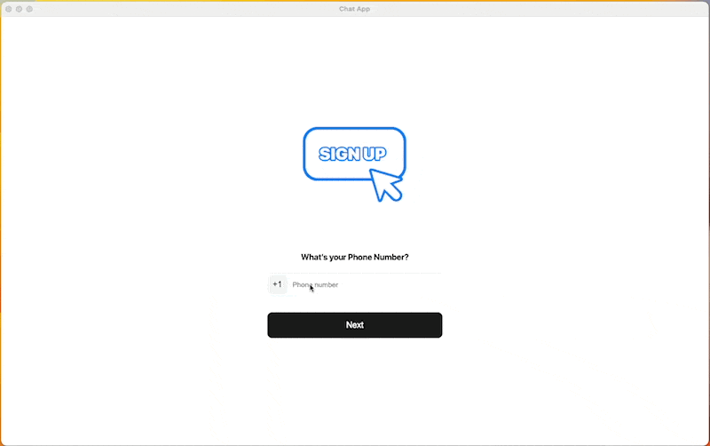

# Chat Elctron JS App



## Install

Clone the repo and install dependencies:

```bash
git clone --branch main https://github.com/kandragu/chat-electron-app.git your-project-name
cd your-project-name
npm install
```

**Having issues installing? See our [debugging guide](https://github.com/electron-react-boilerplate/electron-react-boilerplate/issues/400)**

## Starting Development

Start the app in the `dev` environment:

```bash
npm start
```

## Packaging for Production

To package apps for the local platform:

```bash
npm run package
```
